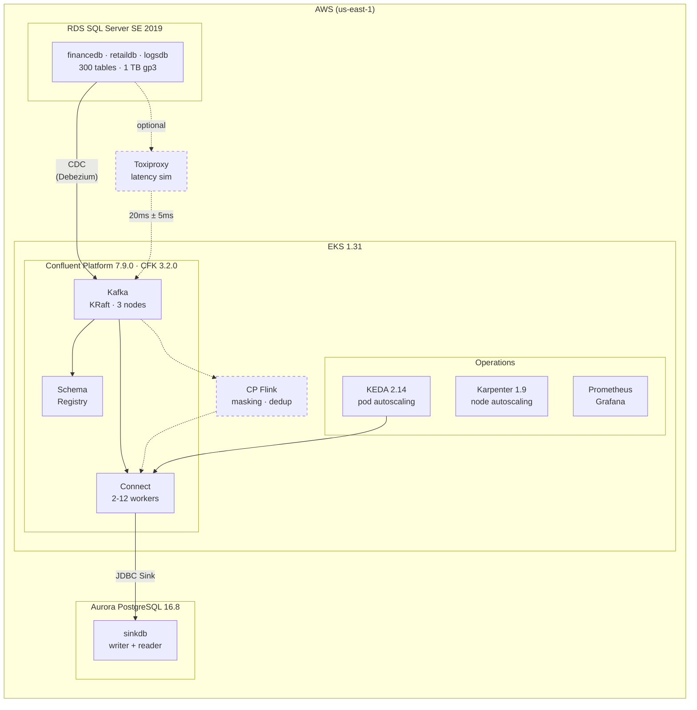

# CDC on Confluent Platform (CPC)

End-to-end Change Data Capture pipeline on AWS, fully automated with Terraform.

**SQL Server** (3 databases, 300 tables) &rarr; **Debezium** &rarr; **Kafka** &rarr; **JDBC Sink** &rarr; **Aurora PostgreSQL**

## Architecture



> **Data flow:** SQL Server &rarr; Debezium (CDC) &rarr; Kafka &rarr; JDBC Sink &rarr; Aurora PostgreSQL.
> Optional: Toxiproxy adds latency between SQL Server and Kafka to simulate on-prem networking.
> Optional: CP Flink provides in-flight masking and deduplication.

## Quick Start

### 1. Clone and configure

```bash
git clone https://github.com/vj-beep/cdc-on-cpc.git
cd cdc-on-cpc

cp terraform.tfvars.example terraform.tfvars
# Edit: my_ip, sqlserver_password, aurora_password (required)
# Optional: project_name, aws_region, instance sizes
```

### 2. Deploy infrastructure

```bash
terraform init
terraform apply    # ~20-30 min
```

Creates: VPC, EKS, RDS SQL Server, Aurora PG, Confluent Platform (Kafka, Schema Registry, Connect at 0 replicas), Karpenter, KEDA, Prometheus, Grafana, and optionally CP Flink.

### 3. Configure kubectl

```bash
aws eks update-kubeconfig \
  --name $(terraform output -raw eks_cluster_name) \
  --region $(terraform output -raw aws_region 2>/dev/null || echo us-east-1)

kubectl get pods -n confluent
```

### 4. Build and push Connect image

```bash
./scripts/build-connect-image.sh
```

### 5. Seed source database

```bash
./scripts/seed-source-db.sh 1GB           # Quick test
./scripts/seed-source-db.sh 1000GB        # Full 1 TB load
./scripts/seed-source-db-fast.sh 1000GB   # Bulk via bcp (~1 TB/hr)
```

### 6. Run snapshot

```bash
./cdc.sh pipeline snapshot 6      # 6 Connect workers
./cdc.sh pipeline verify          # Compare source vs sink row counts
```

### 7. Steady-state CDC

```bash
./cdc.sh pipeline cdc 300         # ~300 GB/day of DML changes
```

---

## Toxiproxy (On-Prem Latency Simulation)

When the CDC source is on-prem, there's network latency between SQL Server and the Connect workers (typically 10-80ms via TGW/Direct Connect). Toxiproxy simulates this without real TGW/DX networking.

### How it works

```
Without Toxiproxy:     Debezium ──────────────────> RDS SQL Server
With Toxiproxy:        Debezium ───> Toxiproxy ───> RDS SQL Server
                                     (+20ms ±5ms)
```

Toxiproxy runs as a K8s Deployment in the `confluent` namespace. When enabled, Debezium connectors route through `toxiproxy.confluent.svc.cluster.local:1433` instead of connecting directly to RDS.

### Enable

Add to `terraform.tfvars`:

```hcl
toxiproxy_enabled    = true    # deploy Toxiproxy; route Debezium through it
toxiproxy_latency_ms = 20      # one-way latency in ms (RTT ~ 2x)
toxiproxy_jitter_ms  = 5       # jitter in ms
```

Then apply:

```bash
terraform apply
```

### Setup and control

```bash
./cdc.sh toxiproxy setup                 # create proxy + apply default latency
./cdc.sh toxiproxy status                # show proxy and active toxics
./cdc.sh toxiproxy latency 30 10         # change to 30ms +/- 10ms
./cdc.sh toxiproxy bandwidth 128000      # cap bandwidth (~1 Gbps)
./cdc.sh toxiproxy reset                 # remove all toxics (passthrough)
```

### Typical latency values

| Scenario | Latency | Jitter |
|---|---|---|
| Same-metro (TGW) | 5-15 ms | 2 ms |
| Cross-region (DX) | 20-40 ms | 5 ms |
| Cross-country | 40-80 ms | 10 ms |

---

## CLI Reference

All pipeline operations go through `./cdc.sh`:

```
./cdc.sh <command> <action> [args]
```

| Command | Actions | Description |
|---|---|---|
| `infra` | `status` | Connector status, pods, errors |
| | `topics [list\|clean\|nuke]` | Manage Kafka topics |
| | `grafana` | Import CDC Grafana dashboard |
| `connect` | `cdc [N]` | Start Connect with CDC profile (default 2 workers) |
| | `bulk [N]` | Bulk profile (default 4 workers) |
| | `aggressive [N]` | Bulk + partition expansion (default 6) |
| | `stop` | Scale Connect to 0 |
| | `restart [name]` | Restart failed connector tasks |
| `pipeline` | `snapshot [N]` | Full snapshot (default 6 workers) |
| | `cdc <GB/day>` | Steady-state DML generation |
| | `monitor` | Re-attach progress monitor |
| | `verify` | Compare source vs sink row counts |
| | `reset` | Stop connectors + clean everything |
| `flink` | `setup` | Create CMF environment + catalog |
| | `sql <file>` | Submit Flink SQL |
| | `app <file>` | Submit FlinkApplication |
| | `status \| stop \| ui \| logs` | Manage Flink apps |
| `toxiproxy` | `setup` | Create proxy + default latency |
| | `status` | Show proxy and toxics |
| | `latency [ms] [jitter]` | Set latency (default 20ms +/- 5ms) |
| | `bandwidth [KB/s]` | Cap bandwidth |
| | `reset` | Remove all toxics |

### Snapshot workflow

`./cdc.sh pipeline snapshot N` automates 6 steps:

1. Count source rows across all 3 databases
2. Reset pipeline (delete connectors, clean consumer groups)
3. Start Connect cluster with N workers
4. Deploy all 6 connectors with `tasks.max` scaled to N
5. Expand topic partitions to N for parallel consumption
6. Monitor until sink row count matches source

Partition expansion re-runs every 60s during monitoring to catch topics created after initial deployment.

---

## Connectors

6 self-managed connectors running on Connect workers via CFK on EKS:

| Connector | Type | Plugin |
|---|---|---|
| `debezium-financedb` | Source | Debezium SQL Server 3.1.2.Final |
| `debezium-retaildb` | Source | Debezium SQL Server 3.1.2.Final |
| `debezium-logsdb` | Source | Debezium SQL Server 3.1.2.Final |
| `jdbc-sink-financedb` | Sink | Confluent JDBC 10.8.0 |
| `jdbc-sink-retaildb` | Sink | Confluent JDBC 10.8.0 |
| `jdbc-sink-logsdb` | Sink | Confluent JDBC 10.8.0 |

The Connect image is built from `confluentinc/cp-server-connect:7.9.0` with Debezium + JDBC Sink plugins pre-installed, pushed to ECR by `./scripts/build-connect-image.sh`.

### Auto-scaling (KEDA)

KEDA scales Connect workers between 2 and 12 replicas:

| Metric | Threshold |
|---|---|
| Task count | 8 tasks/worker |
| Consumer lag | 100K records |
| CPU | 70% |
| Memory | 75% |

---

## Stack Versions

| Component | Version | Notes |
|---|---|---|
| **Confluent Platform** | 7.9.0 | KRaft mode (no ZooKeeper) |
| CFK | 3.2.0 | Helm chart 0.1514.1 |
| Debezium SQL Server | 3.1.2.Final | Apache 2.0 |
| Confluent JDBC Sink | 10.8.0 | `confluent-hub` |
| Kafka UI | v0.7.2 | provectuslabs/kafka-ui |
| **Amazon EKS** | 1.31 | Managed control plane |
| Karpenter | 1.9.0 | Node auto-provisioning |
| RDS SQL Server SE | 2019 | 1 TB gp3, 12K IOPS, db.r6i.8xlarge |
| Aurora PostgreSQL | 16.8 | Writer + reader, db.r6i.2xlarge |
| **KEDA** | 2.14.0 | Connect auto-scaling |
| kube-prometheus-stack | 58.4.0 | Prometheus + Grafana |
| External Secrets Operator | 0.9.16 | Secrets Manager integration |
| cert-manager | v1.18.2 | Required for CP Flink TLS |
| **CP Flink** (optional) | | |
| Flink Kubernetes Operator | 1.130.2 | Manages Flink deployments |
| Confluent Manager for Flink | 2.2.0 | Job management API |
| **Terraform** | >= 1.5 | AWS ~> 5.17, Helm ~> 2.12, K8s ~> 2.25 |

---

## Terraform Modules

| Module | Purpose |
|---|---|
| `modules/networking/` | VPC, subnets, NAT gateway |
| `modules/eks/` | EKS cluster, Karpenter, NodePools |
| `modules/databases/` | Security groups, RDS SQL Server, Aurora PostgreSQL |
| `modules/confluent-platform/` | ECR, CFK, Kafka, KRaft, Schema Registry, Connect, Control Center |
| `modules/connectors/` | Debezium + JDBC Sink connectors, Toxiproxy |
| `modules/observability/` | Prometheus, Grafana, PodMonitors, KEDA, External Secrets |
| `modules/flink/` | cert-manager, Flink Kubernetes Operator, CMF, S3 state |

Root files: `versions.tf` (providers), `variables.tf` (inputs), `data.tf` (data sources), `main.tf` (module wiring), `outputs.tf` (endpoints).

---

## Kafka Configuration

| Setting | Value |
|---|---|
| Replication factor | 3 |
| Min in-sync replicas | 2 |
| Log retention | 72 hours / 5 GB per partition |
| Segment size | 512 MB |
| Storage per broker | 500 Gi (gp3) |
| Auto-create topics | Enabled |

## Namespaces

| Namespace | Components |
|---|---|
| `confluent` | Kafka, KRaft, Schema Registry, Connect, Control Center, Kafka UI, Toxiproxy |
| `keda` | KEDA operator |
| `monitoring` | Prometheus, Grafana |
| `flink` | CP Flink (FKO, CMF) |

---

## Project Structure

```
cdc-on-cpc/
├── versions.tf             Providers
├── variables.tf            All tuneable variables
├── data.tf                 AWS data sources
├── main.tf                 Module wiring
├── outputs.tf              Endpoints and quick reference
│
├── modules/
│   ├── networking/         VPC, subnets
│   ├── eks/                EKS, Karpenter, NodePools
│   ├── databases/          SGs, RDS SQL Server, Aurora PG
│   ├── confluent-platform/ ECR, CFK, Kafka, SR, Connect, CC
│   ├── connectors/         Debezium, JDBC Sink, Toxiproxy
│   ├── observability/      Prometheus, Grafana, KEDA, ESO
│   └── flink/              cert-manager, FKO, CMF, S3
│
├── cdc.sh                  CLI dispatcher
├── env-setup.sh            Export DB endpoints as env vars
├── lib/                    Shell modules (sourced by cdc.sh)
│   ├── common.sh           Endpoints, helpers
│   ├── aurora.sh           Aurora lifecycle
│   ├── kafka.sh            Topic management
│   ├── connect.sh          Connect lifecycle
│   ├── monitor.sh          Snapshot monitoring
│   └── cmd-*.sh            Subcommand implementations
│
├── scripts/
│   ├── build-connect-image.sh   Build Connect image -> ECR
│   ├── seed-source-db.sh        Seed 300 tables
│   ├── seed-source-db-fast.sh   Seed via bcp (~1 TB/hr)
│   ├── teardown.sh              K8s cleanup before terraform destroy
│   ├── migrate-state.sh         Migrate TF state into modules
│   ├── port-forward.sh          Start all port forwards
│   └── mac-setup.sh             Generate Mac-side setup script
│
├── config/
│   ├── grafana/            Dashboard JSON
│   ├── flink-k8s/          Flink K8s manifests
│   ├── flink-jobs/         FlinkApplication JSON
│   └── flink-sql/          Flink SQL statements
│
└── docs/
    ├── GETTING-STARTED.md  Full walkthrough
    └── SNAPSHOT-TUNING.md  Performance tuning
```

## Prerequisites

- AWS account with VPC, EKS, RDS, Aurora, IAM, EC2, ECR permissions
- Terraform >= 1.5, kubectl, helm, aws-cli v2
- Docker (for building the Connect image)
- sqlcmd (ODBC version at `/opt/mssql-tools18/bin/sqlcmd`)
- psql (PostgreSQL 16 client)

> `/opt/mssql-tools18/bin` must be in PATH before `/usr/local/bin` so the ODBC `sqlcmd` is used.

## Teardown

```bash
./scripts/teardown.sh    # K8s cleanup (connectors, namespaces, PVCs)
terraform destroy        # AWS cleanup (EKS, RDS, Aurora, VPC)
```

## Port Forwards (Mac)

```bash
./scripts/mac-setup.sh > mac-connect.sh && bash mac-connect.sh
```

| Service | URL |
|---|---|
| Control Center | http://localhost:9021 |
| Schema Registry | http://localhost:8081 |
| Connect REST | http://localhost:8083 |
| Grafana | http://localhost:3000 (admin/admin) |
| Flink CMF | http://localhost:8090 |

## Further Reading

- **[GETTING-STARTED.md](docs/GETTING-STARTED.md)** — Full walkthrough: seeding, snapshot, CDC, verification, Flink
- **[SNAPSHOT-TUNING.md](docs/SNAPSHOT-TUNING.md)** — Snapshot performance tuning and best practices
