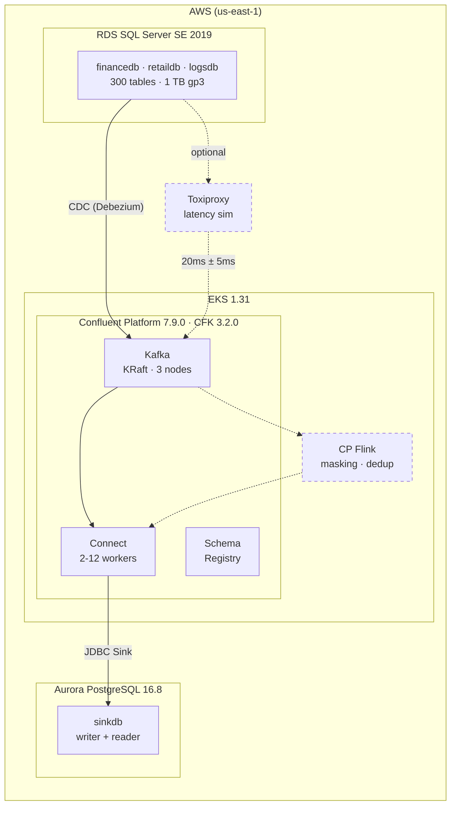

# Getting Started — cdc-on-cpc

A step-by-step guide to deploy and test a fully automated CDC pipeline on AWS.

---

## What You'll Build



### Database Layout (300 tables across 3 databases)

| Type | Count/DB | Columns | Row Size | Examples |
|------|----------|---------|----------|---------|
| Standard (A) | 25 | ~10 | ~600 B | `accounts`, `transactions`, `ledger` |
| Medium (B) | 20 | ~18 | ~1 KB | `journal_entries`, `loan_applications` |
| Reference (C) | 20 | ~5 | ~200 B | `currency_ref`, `status_codes` |
| Junction (D) | 15 | ~6 | ~300 B | `account_contacts`, `product_fees` |
| Event (E) | 15 | ~12 | ~800 B | `account_events`, `txn_audit` |
| **Wide** | 1 | 52 | ~3 KB | `fin_claims_wide` |
| **Narrow** | 1 | 3 | ~50 B | `fin_currency_codes` |
| **LOB** | 1 | 8 | variable | `fin_document_store` |
| **No-PK** | 1 | 7 | ~800 B | `fin_legacy_journal` |
| **PII** | 1 | 15 | ~900 B | `fin_customer_pii` |

### Connector Layout (6 connectors)

| Connector | Type | Tasks | What It Does |
|-----------|------|-------|-------------|
| `debezium-financedb` | Source | 10 | CDC all 100 financedb tables |
| `debezium-retaildb` | Source | 10 | CDC all 100 retaildb tables |
| `debezium-logsdb` | Source | 10 | CDC all 100 logsdb tables |
| `jdbc-sink-financedb` | Sink | 4* | All financedb → Aurora `financedb` schema |
| `jdbc-sink-retaildb` | Sink | 4* | All retaildb → Aurora `retaildb` schema |
| `jdbc-sink-logsdb` | Sink | 4* | All logsdb → Aurora `logsdb` schema |

\* Sink tasks.max defaults to 4 (set in `modules/connectors/main.tf`). During `pipeline snapshot N`, tasks.max is temporarily scaled to N via REST API for parallel writes.

Sink tables are routed into per-database PostgreSQL schemas (`financedb`, `retaildb`, `logsdb`) within the single `sinkdb` database.

### Kafka Topics (auto-created)

No manual topic setup needed. All topics are created when Connect starts:

| Created By | What | Count |
|-----------|------|-------|
| Connect | Internal topics (`confluent.connect-*`) | 3 |
| Debezium | History topics (`_sh_financedb`, etc.) | 3 |
| Debezium | Data topics (1 per table) | 300 |
| Debezium | Heartbeat topics | 3 |
| | **Total** | **~309** |

---

## Prerequisites

```bash
# Required
brew install terraform kubectl helm awscli sqlcmd psql

# Recommended
brew install k9s jq python3

# Verify
terraform -version     # >= 1.5
kubectl version --client
helm version
sqlcmd --version
psql --version
```

AWS account with permissions for VPC, EKS, RDS, Aurora, IAM, EC2, ECR.

---

## Step 0: Clone and Configure

```bash
git clone https://github.com/vj-beep/cdc-on-cpc.git
cd cdc-on-cpc

cp terraform.tfvars.example terraform.tfvars
# Edit terraform.tfvars:
#   project_name, aws_region, my_ip, sqlserver_password, aurora_password
```

---

## Step 1: Provision Infrastructure

```bash
terraform init
terraform plan
terraform apply    # ~20-30 minutes
```

This creates everything: VPC, EKS, RDS SQL Server, Aurora PG, CFK, Kafka, Schema Registry, Connect (0 replicas), Karpenter, KEDA, Prometheus, Grafana, and optionally CP Flink.

**Connect deploys with 0 replicas** — no pods run until you start it after seeding. All 6 connector CRs are created but stay dormant.

```bash
# Configure kubectl
aws eks update-kubeconfig \
  --name $(terraform output -raw eks_cluster_name) \
  --region us-east-1

kubectl get nodes
kubectl get pods -n confluent
```

---

## Step 2: Build Connect Image

```bash
./scripts/build-connect-image.sh
```

Builds a custom Connect image with Debezium SQL Server + JDBC Sink connectors and pushes to ECR. Connect pods won't start without this image.

---

## Step 3: Start Port Forwards

```bash
./scripts/port-forward.sh &
```

| Port | Service |
|------|---------|
| 9021 | Control Center |
| 8080 | Kafka-UI |
| 8081 | Schema Registry |
| 8083 | Connect REST |
| 3000 | Grafana |
| 8084 | Flink CMF |

---

## Step 4: Seed SQL Server

Terraform creates the RDS instance but **no databases or tables**. You must seed before starting Connect.

Two seed scripts are available:

| Script | Method | Speed | Requirements |
|--------|--------|-------|-------------|
| `seed-source-db.sh` | INSERT...SELECT doubling | ~2-4 hrs for 1TB | Any instance |
| `seed-source-db-fast.sh` | bcp bulk import | ~1 hr for 1TB | bcp + Python 3 |

```bash
# Standard (works everywhere)
./scripts/seed-source-db.sh --clean 1GB        # small test (1 GB, ~5 min)
./scripts/seed-source-db.sh 1000GB             # full seed (1 TB, ~2-4 hours)

# Fast (requires bcp + Python 3, large instance recommended)
./scripts/seed-source-db-fast.sh --clean 1GB   # small test (1 GB, ~1 min)
./scripts/seed-source-db-fast.sh 1000GB        # full seed (1 TB, ~1 hour)
```

Both create 3 DBs × 100 tables = 300 tables with CDC enabled. Idempotent — re-run to top up.

### Verify

```bash
# Check DB sizes
sqlcmd -S "$(terraform output -raw sqlserver_endpoint)" \
  -U "$SU" -P "$SW" -Q "
  SELECT d.name, SUM(mf.size)*8.0/1024/1024 AS size_gb
  FROM sys.databases d
  JOIN sys.master_files mf ON d.database_id = mf.database_id
  WHERE d.name IN ('financedb','retaildb','logsdb')
  GROUP BY d.name ORDER BY size_gb DESC;"
```

---

## Step 5: Start Connect

```bash
# CDC profile — 2 workers on cdc-steady nodes
./cdc.sh connect cdc

# Verify connectors auto-started
./cdc.sh infra status
```

All 6 connectors auto-create when Connect pods boot. Debezium begins initial snapshot immediately.

Expected output:

```
  debezium-financedb            RUNNING  tasks: RUNNING
  debezium-retaildb             RUNNING  tasks: RUNNING
  debezium-logsdb               RUNNING  tasks: RUNNING
  jdbc-sink-financedb           RUNNING  tasks: RUNNING/RUNNING/RUNNING/RUNNING
  jdbc-sink-retaildb            RUNNING  tasks: RUNNING/RUNNING/RUNNING/RUNNING
  jdbc-sink-logsdb              RUNNING  tasks: RUNNING/RUNNING/RUNNING/RUNNING
```

---

## Step 6: Test Initial Snapshot (Bulk Throughput)

Measures how fast the pipeline snapshots all data from SQL Server into Aurora.

```bash
# Run snapshot (starts Connect with N workers, resets offsets, monitors progress)
./cdc.sh pipeline snapshot 6
```

This runs 6 steps:
1. Counts source rows in SQL Server
2. Resets pipeline — stops Connect, deletes offsets/schema history, cleans stale consumer groups, drops Aurora schemas
3. Starts Connect with N workers (bulk profile, Aurora tuned for bulk writes)
4. Scales sink `tasks.max` to N per connector via REST API (temporary — CFK reverts after reconcile)
5. Expands topic partitions to N for parallel sink writes (continues expanding during monitor as Debezium creates new topics)
6. Monitors progress with live throughput, ETA, and tuning recommendations

```
  Elapsed    Sink         Remaining    Rate/m     Pct
  0m         0            3840000000   0/m        0%
  1m         2000000      3838000000   4000k/m    0%
  ...
  120m       3840000000   0            32000k/m   100%

  Done: 3840000000 rows | 120m | 32000000/min
```

After snapshot completes, `cdc.sh` automatically reverts Aurora tuning and prints a summary with:
- Total rows, wall time, throughput
- Per-schema and per-table breakdown
- Tuning recommendations for next run

---

## Step 7: Test Steady-State CDC

Generates continuous INSERT/UPDATE/DELETE DML against SQL Server. Debezium captures changes via CDC and JDBC sinks write to Aurora in real-time.

```bash
# 300 GB/day sustained load
./cdc.sh pipeline cdc 300

# Or lighter load
./cdc.sh pipeline cdc 100

# Ctrl+C to stop
```

Output:

```
   +=== CDC Load: 300 GB/day ===

    Target:    5400 rows/sec (3 MB/s)
    Batch:     500 rows
    DML mix:   70% INSERT, 20% UPDATE, 10% DELETE
    Ctrl+C to stop.

  Elapsed    Total Ops    Rate/s     GB est
  5m         1620000      5400/s     0.98GB
```

### Re-attach Monitor

If you want to watch Aurora progress in another terminal:

```bash
./cdc.sh pipeline monitor
```

---

## Step 8: Verify CDC Challenges

### No Primary Key

Tables like `fin_legacy_journal` have no PK. Debezium uses `message.key.columns` to define a composite key:

```bash
# UPDATE on no-PK table — should upsert correctly in Aurora
sqlcmd -S "$SC" -U "$SU" -P "$SW" -d financedb \
  -Q "UPDATE dbo.fin_legacy_journal SET severity=N'WARN' WHERE source_id=N'src-1'"

# Verify in Aurora (note: schema-qualified table name)
psql -h "$PH" -p "$PP" -U "$PU" -d "$PD" \
  -c "SELECT * FROM financedb.fin_legacy_journal WHERE source_id='src-1' LIMIT 5;"
```

### LOB Replication

Tables like `fin_document_store` have `NVARCHAR(MAX)` and `VARBINARY(MAX)`. Configured with `binary.handling.mode=bytes` and 20 MB producer/topic limits:

```bash
# Compare sizes
sqlcmd -S "$SC" -U "$SU" -P "$SW" -d financedb \
  -Q "SELECT id, doc_title, DATALENGTH(doc_body)/1024 AS body_kb FROM dbo.fin_document_store"

psql -h "$PH" -p "$PP" -U "$PU" -d "$PD" \
  -c "SELECT id, doc_title, pg_column_size(doc_body)/1024 AS body_kb FROM financedb.fin_document_store;"
```

### Case Mapping (PascalCase → lowercase)

PostgreSQL auto-lowercases unquoted identifiers. JDBC sink `auto.create=true` creates tables without quoting:

```bash
psql -h "$PH" -p "$PP" -U "$PU" -d "$PD" \
  -c "SELECT column_name FROM information_schema.columns
      WHERE table_schema='financedb' AND table_name='fin_claims_wide' LIMIT 10;"
# All lowercase
```

### PII Tables

PII tables (`fin_customer_pii`, `ret_customer_profiles`, `log_user_activity`) are replicated as-is. For in-flight masking, use CP Flink (Step 9).

---

## Step 9: Monitor with Grafana

```bash
./cdc.sh infra grafana
open http://localhost:3000/d/cdc-pipeline-flow
# Default: admin / admin
```

| Section | Metrics |
|---------|---------|
| 📤 SOURCE | Records polled/sec, poll batch time, active records |
| 🔬 DEBEZIUM | Snapshot running, committed transactions, queue capacity |
| 📊 KAFKA | Consumer lag per sink, records lag avg/max |
| 📥 SINK | Records sent/sec, batch latency, errors |
| ⚙️ WORKERS | Task count, CPU/memory per task, rebalances |

---

## Step 10: CP Flink (Optional)

For in-flight masking, deduplication, and loop prevention using Flink SQL:

```bash
./cdc.sh flink setup
./cdc.sh flink sql config/flink-sql/01-create-masked-tables.sql
./cdc.sh flink sql config/flink-sql/02-masking-dml.sql
./cdc.sh flink status
./cdc.sh flink ui cdc-masking 8091
```

---

## Teardown

```bash
./scripts/teardown.sh         # K8s cleanup
terraform destroy     # AWS cleanup
```

---

## Quick Reference

```bash
# ─── INFRA ───────────────────────────────────
./cdc.sh infra status               # connectors + pods
./cdc.sh infra topics               # list Kafka topics

# ─── CONNECT ─────────────────────────────────
./cdc.sh connect cdc                # 2 workers, CDC profile
./cdc.sh connect cdc 3              # 3 workers
./cdc.sh connect bulk               # 4 workers, NVMe bulk profile
./cdc.sh connect bulk 6             # 6 workers (aggressive)
./cdc.sh connect stop               # scale to 0

# ─── PIPELINE ────────────────────────────────
./cdc.sh pipeline snapshot 6        # 6 workers, full reset + snapshot
./cdc.sh pipeline cdc 300           # 300 GB/day steady DML
./cdc.sh pipeline monitor           # re-attach progress monitor
./cdc.sh pipeline verify            # compare SQL Server vs Aurora
./cdc.sh pipeline reset             # stop + clean everything

# ─── FLINK ───────────────────────────────────
./cdc.sh flink setup                # create CMF env + catalog
./cdc.sh flink sql <file>           # submit Flink SQL
./cdc.sh flink app <file>           # submit FlinkApplication
./cdc.sh flink status               # show apps + pods
./cdc.sh flink stop [app]           # stop apps
./cdc.sh flink ui <app> [port]      # Flink Web UI
./cdc.sh flink logs <app>           # tail JM logs

# ─── SEED / TUNING ──────────────────────────
./scripts/seed-source-db.sh --clean 10GB     # clean + seed 10 GB (standard)
./scripts/seed-source-db.sh 1000GB           # top up to 1 TB
./scripts/seed-source-db-fast.sh --clean 10GB  # clean + seed 10 GB (bcp, fast)
./scripts/seed-source-db-fast.sh 1000GB      # top up to 1 TB (~1 hr)
./cdc.sh infra topics clean         # wipe CDC topics
./cdc.sh infra topics nuke          # wipe everything
./cdc.sh infra grafana              # import Grafana dashboard
./scripts/port-forward.sh &                 # all port forwards
```

---

## File Reference

### Terraform Modules

| Module | Purpose |
|------|---------|
| `modules/networking/` | VPC, subnets, NAT gateway |
| `modules/eks/` | EKS cluster, Karpenter, NodePools |
| `modules/databases/` | Security groups, RDS SQL Server, Aurora PostgreSQL |
| `modules/confluent-platform/` | ECR, CFK, Kafka, KRaft, Schema Registry, Connect, Control Center |
| `modules/connectors/` | Debezium + JDBC Sink connectors, Toxiproxy |
| `modules/observability/` | Prometheus, Grafana, PodMonitors, KEDA, External Secrets |
| `modules/flink/` | cert-manager, Flink Kubernetes Operator, CMF, S3 state |

Root: `versions.tf`, `variables.tf`, `data.tf`, `main.tf`, `outputs.tf`

### Scripts

| Script | Purpose |
|--------|---------|
| `cdc.sh` | Main CLI: `infra`, `connect`, `pipeline`, `flink`, `toxiproxy` |
| `scripts/seed-source-db.sh` | Seed 3 DBs x 100 tables (INSERT...SELECT doubling) |
| `scripts/seed-source-db-fast.sh` | Seed via bcp bulk import (~1 TB/hr) |
| `scripts/build-connect-image.sh` | Build custom Connect image -> ECR |
| `scripts/port-forward.sh` | Start all port forwards |
| `scripts/teardown.sh` | K8s cleanup before `terraform destroy` |
| `scripts/migrate-state.sh` | Migrate TF state into module structure |
| `scripts/mac-setup.sh` | Generate Mac-side setup script |
| `env-setup.sh` | Export env vars for DB endpoints |

### Config

| Directory | Contents |
|-----------|----------|
| `config/flink-sql/` | Flink SQL: masking, dedup, loop prevention |
| `config/flink-jobs/` | FlinkApplication JSON specs |
| `config/flink-k8s/` | Flink K8s manifests, catalog, compute pool |
| `config/grafana/` | CDC pipeline Grafana dashboard |

### Docs

| File | Purpose |
|------|---------|
| `README.md` | Project overview |
| `docs/GETTING-STARTED.md` | This guide |
| `docs/SNAPSHOT-TUNING.md` | Snapshot performance tuning |
